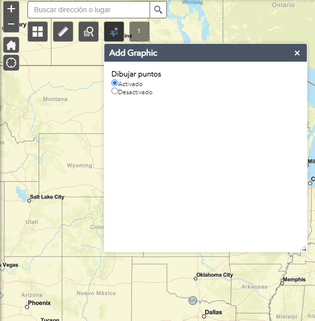
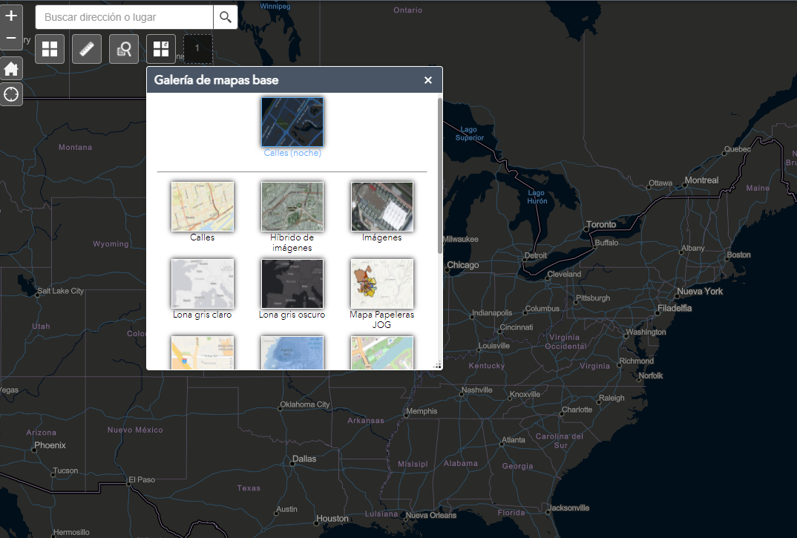
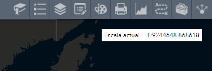
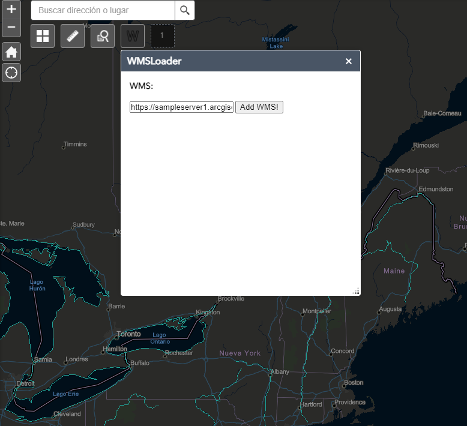
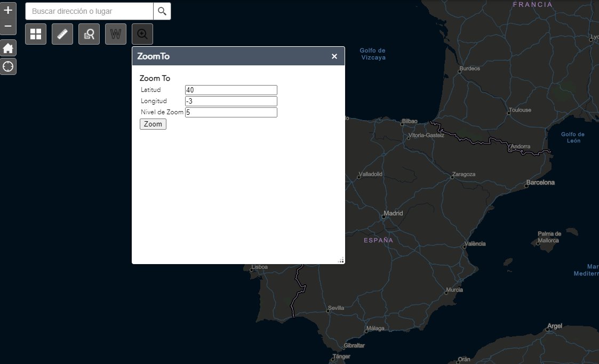

# Widgets personalizados WAB

# 1. AddGraphic
Widgets que permite añadir puntos al mapa.

Esto se puede hacer cuando hemos marcado la opción de "Activado". Si lo marcamos como desactivado no podemos añadir puntos.

# 2. Basemap Gallery personalizado
Personalización del basemap Gallery.
Descargado de [https://gis.calhouncounty.org/WAB/V2.8/widgets/eBasemapGallery/index.html](GeoNet)

# 3. Escala numérica
Widget outPanel de escala numérica

# 4. Carga de capas WMS
Carga de capas WMS, en la configuración se especifica qué capa mostrar

# 5. Centrar el mapa
Widget inPanel que permite hacer zoom y centrar el mapa a partir de longitud y latitud

